---

## Who I Am

I'm a Flutter developer based in Bahawalpur, Pakistan. I build cross-platform mobile apps — Android & iOS — with a focus on clean architecture, real-world performance, and UI that doesn't feel like a template.

Currently working at **Eagle Solutions** while shipping real projects on the side. I don't build things for the portfolio — I build things that solve actual problems.

- 🏥 Built **Tabeeb** — a full healthcare ecosystem with dual-app architecture for patients, doctors & admins
- 💖 Shipped **ForeverUs** — a private couple memories app on Google Play
- 🌍 Based in Bahawalpur | Open to remote freelance work
- 📩 Reach me at **flutterbyahmad@gmail.com**

---

## Tech Stack

  

---

## Skills

---

## Projects

### 🏥 Tabeeb — Healthcare Digital Ecosystem
> Flutter • Firebase • Cloudinary • Provider • Dart

Healthcare in Pakistan runs on WhatsApp and phone calls. Tabeeb replaces that with a proper consultation system — from doctor discovery to appointment completion — inside a single dual-role app.

**What it does:**
- Unified app handles both Patient and Doctor journeys through role-based routing
- Dedicated Admin Dashboard for doctor onboarding, credential verification, and platform oversight
- Full appointment lifecycle: request → accept → complete → cancel, with Firebase push notifications at each stage
- Cloudinary-powered media pipeline for secure document and profile image management
- Local hydration engine for offline-resilient data access

**How it was built:**
Modular controller-based architecture with a 6-week delivery cycle — from schema design and role-based auth to the full admin verification portal and QA. The system handles complex user journeys without bloating the codebase through strict separation of concerns.

`Status: Review`

---

### 💖 ForeverUs — Couple Sync App
> Flutter • Firebase • Firestore

A private space for couples — shared memories, anniversaries, and reminders that don't get lost in a group chat.

- Real-time sync between two accounts
- Secure private photo memories
- Smart anniversary & event reminders

`Status: Live on Google Play`

---

## GitHub Stats

  

---

## Contribution Snake

  <picture>
    <source media="(prefers-color-scheme: dark)" srcset="https://raw.githubusercontent.com/Waleed-Dev114/Waleed-Dev114/output/github-contribution-grid-snake-dark.svg"/>
    <source media="(prefers-color-scheme: light)" srcset="https://raw.githubusercontent.com/Waleed-Dev114/Waleed-Dev114/output/github-contribution-grid-snake.svg"/>
    
  </picture>

---

## Let's Connect

  

> 💬 Got an app idea? I'll tell you in the first call if it's buildable — and how long it'll take.

---

